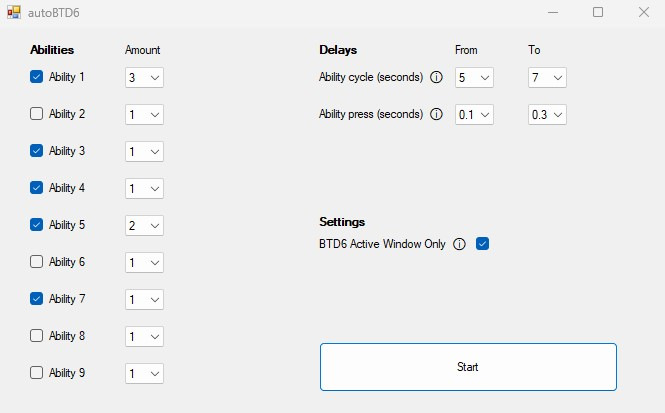

 

  

  

autoBTD6 is a Windows Desktop Application written in C# with .NET Framework that automates triggering and usage of abilities in Bloons Tower Defense 6 (BTD6). The user can dynamically select which abilities they want triggered, the amount of each, set randomized human-like triggering delays, and only trigger ability keys in the BTD6 window.     
    <a href="https://github.com/trevtravtrev/autoBTD6/issues">Report Bug</a>
     | 
    <a href="https://github.com/trevtravtrev/autoBTD6/issues">Request Feature</a>
  

  

## Features

- Automate ability usage in Bloons Tower Defense 6 (BTD6).  
- Dynamically select abilities to use.  
- Set the amount of each ability to use.  
- Set human-like delays between each ability usage cycle and individual ability usages.  
- Choose whether to trigger abilities only in the active BTD6 window or in any active window.  
- Simple and easy-to-use interface.  
- Open-source and customizable.  

## Dependencies

autoBTD6 has following dependencies:  
- Windows operating system  
- .NET Framework 4.7.2 or higher  
- `user32.dll` for finding windows  
- AutoIt v3 for ability triggering  

## Interface

  

## How to run (simple)  

1. Download the latest release from the [releases page](https://github.com/trevtravtrev/autoBTD6/releases).
2. Extract the contents of the zip file to a location of your choice.
3. Run `autoBTD6.exe`.
4. Desktop Shortcut: right click autoBTD6.exe => "Send To" => Desktop (Create Shortcut).

## How to run by building the project (hard)  

1. Clone the repository or download the source code.
2. Open the `autoBTD6.sln` solution file in Visual Studio.
3. In the Solution Explorer window, right-click on the autoBTD6 project and select "Manage NuGet Packages".
4. In the NuGet Package Manager, search for "AutoItX".
5. Click on the "AutoItX" package and select the appropriate version for the project.
6. Click on the "Install" button to add the package to your project.
7. Build the project by selecting Build > Build Solution from the menu bar.
8. After building, navigate to the `autoBTD6\bin\Debug` folder.
9. Double-click the `autoBTD6.exe` file to run the program.
10. Desktop Shortcut: right click autoBTD6.exe => "Send To" => Desktop (Create Shortcut).

## Settings

It is recommended to stop autoBTD6 when you want to place a new tower then start it again. Ability triggering cancels tower placement.  

| Settings                         | Description                                                                                     |
|----------------------------------|-------------------------------------------------------------------------------------------------|
| Ability Checkboxes 1-9           | Checkboxes that allow you to select which abilities you want to trigger.                       |
| Ability Amount Dropdowns 1-9     | Dropdowns that allow you to select the amount of each ability you have available (1-10).       |
| Ability Cycle (Seconds) Range    | A random delay in seconds after each cycle of all abilities being triggered.                   |
| Ability Press (Seconds) Range    | A random delay in seconds after each ability has been triggered.                               |
| BTD6 Active Window Only Checkbox | When on, ONLY activates ability keypresses in the active BTD6 game window. Keep ON unless abilities are not being triggered in game. When off, it will trigger ability keypresses in any active window. |
| Start Button                     | Start or stop the program.                                                                       |

## Disclaimer  

The usage of this program is at your own risk. The author is not responsible for any damages or consequences caused by the usage of this program. It is recommended to use the program responsibly and within the terms of service of the game. Please note that using third-party tools to automate gameplay may violate the game's terms of service and result in a ban. Use at your own discretion.
